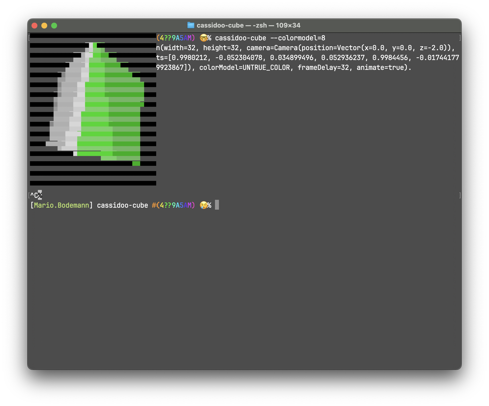

~~~ Cassidoo Cube ~~~
=======================
    
This is the result of getting inspired by something amazing. Drawing a cube. In the command line.
Thanks @cassidoo. 

Please build and run the app to see what it does, or read the other explanation:

> ./gradlew run --args='--help'

Thanks

Previews
----------

Trouble Shooting
----------------

In case of bad colors, use `--colormodel=8`. Possibly your terminal does not support true color. A shame.